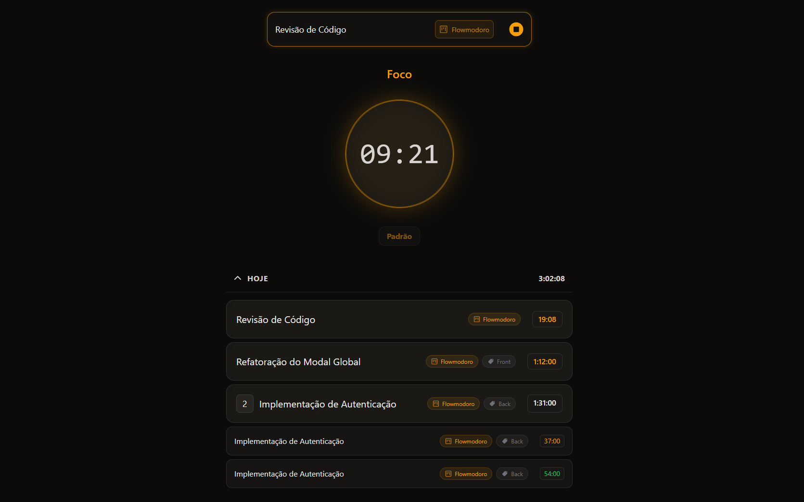
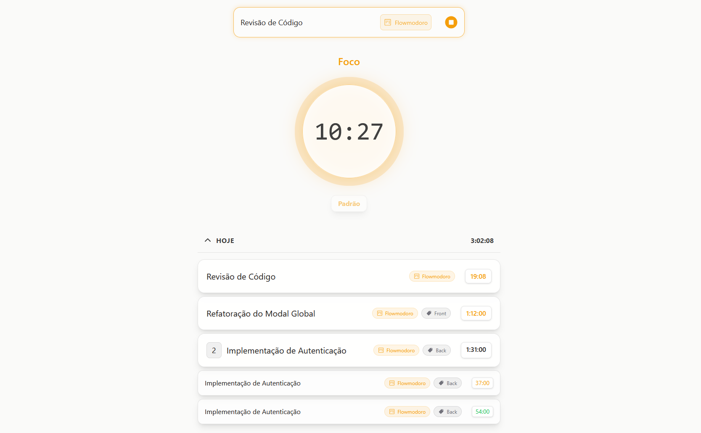

# Flowmodoro

O **Flowmodoro** é uma ferramenta de produtividade desenvolvida para ajudar usuários a equilibrar sessões de trabalho focado com períodos de descanso, utilizando a abordagem de "fluxo" para a gestão de tempo.

## 🎨 Interface

A aplicação conta com um design moderno e minimalista, com suporte completo a temas claro e escuro.

<div align="center">
  <p><strong>Tema Escuro</strong></p>
  
  <br/>
  <p><strong>Tema Claro</strong></p>
  
</div>

## 🚀 Funcionalidades

### Timer de Fluxo

O timer é o componente principal da aplicação. O diferencial está no cálculo automático de pausas baseado no tempo de foco total do usuário.

Além disso, ele é persistente: a contagem não é interrompida mesmo que o usuário troque de aba ou feche o navegador. Ao abrir a aplicação novamente, o último estado é recuperado e o tempo é recalculado com base na data atual, mantendo o timer consistente.

Também é possível selecionar três modos de fluxo:

- **Intenso**: utiliza 10% do foco total para o descanso;
- **Padrão**: utiliza 20% para o descanso;
- **Leve**: utiliza 30% para o descanso;

Quando o usuário inicia o descanso calculado pelo app, ele pode:

- esperar até o término (uma notificação será enviada ao finalizar);
- ou pular a pausa e iniciar uma nova sessão.

### Gestão de Projetos e Tags

A aplicação conta com uma barra lateral (*sidebar*) à direita para gerenciar projetos e tags, que podem ser atribuídos às sessões de forma opcional.

Nela é possível:

- Criar novos projetos e suas respectivas tags (as tags são exclusivas de cada projeto);
- Editar e excluir projetos e tags;
- Visualizar o tempo total acumulado por projeto e por tag ao longo do tempo, conforme são utilizados nas sessões.

### Histórico de Sessões

Ao finalizar o timer, um modal é exibido perguntando se o usuário deseja salvar ou descartar a sessão.

Caso a sessão seja salva, ela aparecerá na parte inferior da tela, agrupada por dia. A forma de listagem e agrupamento foi inspirada em ferramentas como [Toggl Track](https://toggl.com/) e [Clockify](https://clockify.me/).

### Design Responsivo

A aplicação funciona tanto em desktop quanto em dispositivos móveis e possui suporte completo a PWA.

Em navegadores como o Chrome no celular, é possível instalar a aplicação para que ela fique disponível como um app nativo no dispositivo.

## 🛠️ Tecnologias

### Backend

- **Java 21** com **Spring Boot 3.5.6**
- **PostgreSQL** para persistência de dados
- **Spring Data JPA** & **Lombok**
- **Maven** como gerenciador de dependências

### Frontend

- **React 19** com **TypeScript** e **Vite**
- **Tailwind CSS 4** para estilização
- **React Context API** para gerenciamento de estado
- **Axios** para comunicação com a API

## 🚀 Deploy

O deploy foi realizado em plataformas gratuitas. Por conta disso, em alguns momentos pode haver:

- **cold start** da API
- **sleep** do banco de dados por falta de uso

### Plataformas utilizadas

- **Frontend:** Vercel
- **API Spring:** Render
- **Banco de Dados:** Aiven

A aplicação pode ser acessada aqui:  
👉 https://flowmodoro-jsn.vercel.app/

## 🏁 Como rodar localmente

### Pré-requisitos

- Docker e Docker Compose
- Java 21+
- Node.js 20+

### Instalação

1. **Clonar o repositório:**

   ```bash
   git clone https://github.com/seu-usuario/flowmodoro.git
   cd flowmodoro
   ```

2. **Subir o banco de dados:**

   ```bash
   docker compose up -d
   ```

3. **Configurar o Backend:**
   - Navegue até `backend/`
   - Configure o arquivo `.env` baseado no `.env.example`
   - Execute: `./mvnw spring-boot:run`

4. **Configurar o Frontend:**
   - Navegue até `frontend/`
   - Execute: `npm install`
   - Configure o arquivo `.env` baseado no `.env.example`
   - Execute: `npm run dev`

## 📄 Licença

Este projeto está sob a licença [MIT](LICENSE).
