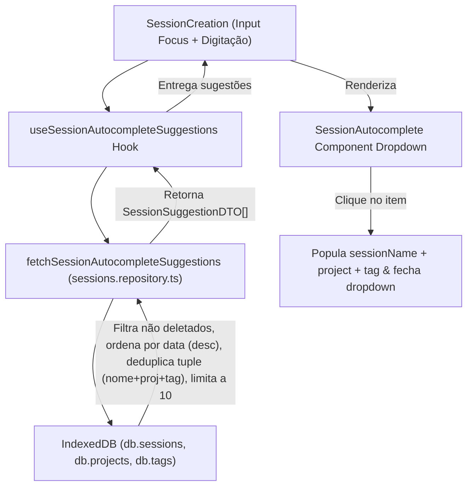

# Plano de Implementação: Auto-complete de Sessões Anteriores no SessionCreation

Este documento detalha o plano de implementação técnica para a especificação `_specs/session-autocomplete-select.spec.md`, adicionando sugestões autocompletáveis ao digitar no componente `SessionCreation`.

## 1. Visão Geral

O objetivo desta funcionalidade é permitir que o usuário, ao digitar o nome de uma sessão no campo `SessionCreation`, veja uma lista suspensa (dropdown/select) com até **10 sugestões** de sessões anteriores armazenadas no IndexedDB local. Ao selecionar uma sugestão, os campos `sessionName`, `project` e `tag` do `SessionCreation` são preenchidos automaticamente.

## 2. User Review Required

> [!IMPORTANT]
> **Bloqueio em Timer Ativo e Modo Break**: O select de sugestões só aparecerá se `mode === null` (timer parado / não iniciado). Se o timer estiver rodando (`mode === "focus"` ou `mode === "break"`) ou parado aguardando o início da pausa (`mode === "stopped"`), o autocomplete **não será exibido**, atendendo rigorosamente à regra de negócio RN-05.

> [!NOTE]
> **Deduplicação Inteligente**: Caso o usuário tenha realizado múltiplas sessões com o mesmo nome "Estudar React", mas associadas a projetos ou tags diferentes (ex: Projeto Frontend vs Projeto Backend), cada variação única será exibida como um item selecionável. Apenas combinações idênticas `(nome + projeto + tag)` serão deduplicadas, exibindo a mais recente.

---

## 3. Arquitetura da Solução



---

## 4. Proposed Changes

### DTOs & Mapeamentos

#### [MODIFY] `frontend/src/features/sessions/dtos/sessions-response.ts`

Adicionar a interface DTO para as sugestões de autocomplete:

```typescript
export interface SessionSuggestionDTO {
  id: string;
  name: string;
  project: {
    id: string;
    name: string;
    color: string;
  } | null;
  tag: {
    id: string;
    name: string;
  } | null;
  date: string;
}
```

---

### Camada de Repositório (Local / IndexedDB)

#### [MODIFY] `frontend/src/features/sessions/local/sessions.repository.ts`

Implementar a função `fetchSessionAutocompleteSuggestions`:

```typescript
export const fetchSessionAutocompleteSuggestions = async (
  searchTerm: string,
): Promise<SessionSuggestionDTO[]> => {
  const normalizedSearch = searchTerm.trim().toLowerCase();
  if (!normalizedSearch) return [];

  const sessions = await db.sessions.toArray();
  const projects = await db.projects.toArray();
  const tags = await db.tags.toArray();

  const projectMap = new Map(projects.map((p) => [p.id, p]));
  const tagMap = new Map(tags.map((t) => [t.id, t]));

  // 1. Filtrar sessões ativas (não deletadas) que contêm o termo de busca
  const matchingSessions = sessions.filter((s) => {
    if (s.deletedAt) return false;
    return s.name.toLowerCase().includes(normalizedSearch);
  });

  // 2. Ordenar por data mais recente primeiro (decrescente)
  matchingSessions.sort(
    (a, b) => new Date(b.date).getTime() - new Date(a.date).getTime(),
  );

  // 3. Deduplicar pela combinação única de (nome + projectId + tagId)
  const seenCombinations = new Set<string>();
  const suggestions: SessionSuggestionDTO[] = [];

  for (const session of matchingSessions) {
    const key = `${session.name.trim().toLowerCase()}|${session.projectId || ""}|${session.tagId || ""}`;
    if (seenCombinations.has(key)) continue;

    seenCombinations.add(key);

    const project = session.projectId
      ? projectMap.get(session.projectId)
      : null;
    const tag = session.tagId ? tagMap.get(session.tagId) : null;

    suggestions.push({
      id: session.id,
      name: session.name,
      project: project
        ? { id: project.id, name: project.name, color: project.color }
        : null,
      tag: tag ? { id: tag.id, name: tag.name } : null,
      date: session.date,
    });

    if (suggestions.length >= 10) break;
  }

  return suggestions;
};
```

---

### Camada de Hooks (React Query)

#### [MODIFY] `frontend/src/features/sessions/hooks/useSessions.ts`

Adicionar a chamada React Query para buscar as sugestões com cache e invalidação automática:

```typescript
export const useSessionAutocompleteSuggestions = (
  searchTerm: string,
  enabled: boolean = true,
) => {
  const trimmedTerm = searchTerm.trim();

  return useQuery({
    queryKey: [
      APP_DATA_QUERY_KEY,
      SESSIONS_QUERY_KEY,
      "autocomplete",
      trimmedTerm,
    ],
    queryFn: () => fetchSessionAutocompleteSuggestions(trimmedTerm),
    enabled: enabled && trimmedTerm.length > 0,
    staleTime: 1000 * 60,
  });
};
```

---

### Camada de Componentes

#### [NEW] `frontend/src/features/sessions/components/SessionCreation/SessionAutocomplete.tsx`

Criar o componente de dropdown para renderizar as sugestões com design integrado ao tema da aplicação:

```tsx
import clsx from "clsx";
import { GoProject } from "react-icons/go";
import { IoMdPricetag } from "react-icons/io";
import type { SessionSuggestionDTO } from "../../dtos/sessions-response";
import { getStableProjectColor } from "../../../projects/consts/project-colors";

interface SessionAutocompleteProps {
  suggestions: SessionSuggestionDTO[];
  onSelect: (suggestion: SessionSuggestionDTO) => void;
}

const SessionAutocomplete = ({
  suggestions,
  onSelect,
}: SessionAutocompleteProps) => {
  if (suggestions.length === 0) return null;

  return (
    <div
      className={clsx(
        "absolute top-[105%] left-0 right-0 z-20 w-full",
        "bg-neutral-80/95 backdrop-blur-md border border-border rounded-xl shadow-xl",
        "py-2 max-h-[320px] overflow-y-auto divide-y divide-border/40",
      )}
    >
      {suggestions.map((item) => {
        const projectColor = item.project
          ? getStableProjectColor(item.project.id, item.project.color)
          : undefined;

        return (
          <div
            key={item.id}
            onMouseDown={(e) => {
              // Evita que o evento blur do input seja disparado antes da seleção
              e.preventDefault();
              onSelect(item);
            }}
            className={clsx(
              "px-4 py-2.5 flex items-center justify-between cursor-pointer",
              "hover:bg-neutral-70/60 transition-colors duration-150 group",
            )}
          >
            <span className="font-medium text-neutral-10 truncate text-sm sm:text-base">
              {item.name}
            </span>

            <div className="flex items-center gap-2 shrink-0">
              {item.project && (
                <span
                  className="flex items-center gap-1 text-xs px-2 py-0.5 rounded-md border font-medium"
                  style={{
                    backgroundColor: `${projectColor}1a`,
                    borderColor: `${projectColor}40`,
                    color: projectColor,
                  }}
                >
                  <GoProject className="text-xs" />
                  {item.project.name}
                </span>
              )}

              {item.tag && (
                <span className="flex items-center gap-1 text-xs px-2 py-0.5 rounded-md border font-medium bg-secondary/15 border-secondary/40 text-neutral-20">
                  <IoMdPricetag className="text-xs" />
                  {item.tag.name}
                </span>
              )}
            </div>
          </div>
        );
      })}
    </div>
  );
};

export default SessionAutocomplete;
```

#### [MODIFY] `frontend/src/features/sessions/components/SessionCreation/SessionCreation.tsx`

Substituir o bloco de teste fixo pelo componente `SessionAutocomplete` e conectar o estado de foco e seleção:

```tsx
// 1. Importar o hook e o componente
import SessionAutocomplete from "./SessionAutocomplete";
import { useSessionAutocompleteSuggestions } from "../../hooks/useSessions";
import { useClickOutside } from "../../../../shared/hooks/useClickOutside";

// 2. Estado de foco e ref da div principal
const [isFocused, setIsFocused] = useState(false);
const containerRef = useRef<HTMLDivElement>(null);

useClickOutside(containerRef, () => {
  setIsFocused(false);
});

// 3. Buscar sugestões
const { data: suggestions = [] } = useSessionAutocompleteSuggestions(
  sessionName,
  isFocused && mode === null,
);

// 4. Handler para selecionar uma sugestão
const handleSelectSuggestion = (suggestion: SessionSuggestionDTO) => {
  setSessionName(suggestion.name);
  setContextSessionName(suggestion.name);

  if (suggestion.project) {
    setSelectedProjectId(suggestion.project.id);
  } else {
    setSelectedProjectId(null);
  }

  if (suggestion.tag) {
    setSelectedTagId(suggestion.tag.id);
  } else {
    setSelectedTagId(null);
  }

  setIsFocused(false);
};

// 5. No input, adicionar onFocus
<input
  // ...
  onFocus={() => setIsFocused(true)}
  // ...
/>;

// 6. Substituir as linhas 326-332 pelo dropdown responsivo
{
  isFocused && hasContent && mode === null && suggestions.length > 0 && (
    <SessionAutocomplete
      suggestions={suggestions}
      onSelect={handleSelectSuggestion}
    />
  );
}
```

---

## 5. Verification Plan

### Automated Tests

- Executar `npm test` ou o test runner do frontend para garantir que a suite de testes atual continua passando sem regressões.

### Manual Verification

1. **Digitação e Sugestão:** Com sessões existentes no banco local, clicar no input do `SessionCreation` e digitar parte do nome de uma sessão. Verificar se o dropdown aparece com até 10 sugestões ordenadas da mais recente para a mais antiga.
2. **Seleção e Autopreenchimento:** Clicar em uma sugestão do dropdown. Confirmar que o nome da sessão, a tag e o projeto (com as respectivas cores e seletores) são preenchidos no `SessionCreation`.
3. **Comportamento em Timer Ativo / Break:** Iniciar o timer de foco ou avançar para a pausa ("break"). Verificar que o dropdown de sugestões não é exibido mesmo se o usuário focar no input ou alterar texto.
4. **Resolução de Foco / Clique Fora:** Clicar fora do container do `SessionCreation` e garantir que o dropdown é ocultado imediatamente.
5. **Responsividade Mobile:** Testar o dropdown em tela mobile (< 640px) e verificar se a largura do dropdown acompanha 100% o container do `SessionCreation` sem estouro de layout.
